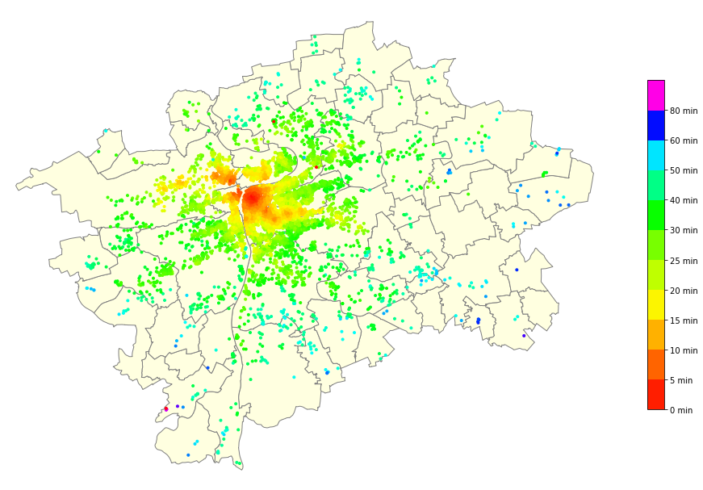

# Exploratory analysis of the Airbnb listings in Prague, Czech Republic
This repository includes two Jupyter notebooks:
* `prague-airbnb.ipynb` - data preprocessing, fitting a regression model, visualisation of feature importance via `SHAP`
* `prague-airbnb-visualisation.ipynb` - plotting geographical data from the dataset via `geoplot`

## Installation
You can run these notebooks on your Jupyter notebook installation with following prerequisites:
* [PROJ](https://proj.org/index.html) - coordinate transformation software
* [GEOS](https://trac.osgeo.org/geos/) - Geometry Engine, Open Source

In addition, these python libraries are used (install them with `pip install <library_name>`):
* `geoplot` - library for plotting geospatial data
* `xgboost` - implementation of the XGBoost gradient boosting algorithm
* `shap` - [SHapley Additive exPlanations](https://github.com/slundberg/shap) - library for Shapley value based explanations of machine learning models

## Running in Docker :whale: (Recommended)
All software and python packages are already in specified in the `Dockerfile`, which is built on top of the official Jupyter Notebook SciPy docker image [https://github.com/jupyter/docker-stacks](https://github.com/jupyter/docker-stacks).

After cloning the repository, simply run `docker-compose up` and after building the image and running the container, you will be able to access the notebooks with a provided `localhost` URL.

